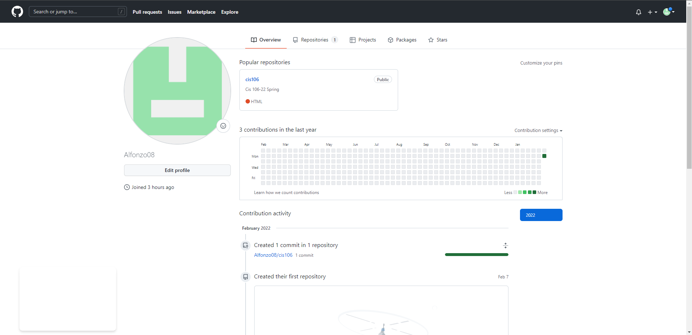

# Week Report 0
## Summary of Presentation: Introduction to CIS 106

+ Linux is the global operating system. 
+ it has the largest collaboration in human history.
+ open source/free software
+ linux is used in almost every computer company in the world.
+ we learn the difference between GIT/Github.
+ GIT is a version control system,track change,backup,team dev.
+ github is more hosted git 

## My github account

## Final Project Research: Pick a project

+ Host a simple website in Ubuntu Server using Apache/NGINX 🌟
+ Build a portable Hacking Machine with a Raspberry Pi and Kali Linux 🌟
+ Recover Data from an erased disk with Kali Linux and a Raspberry Pi 🌟